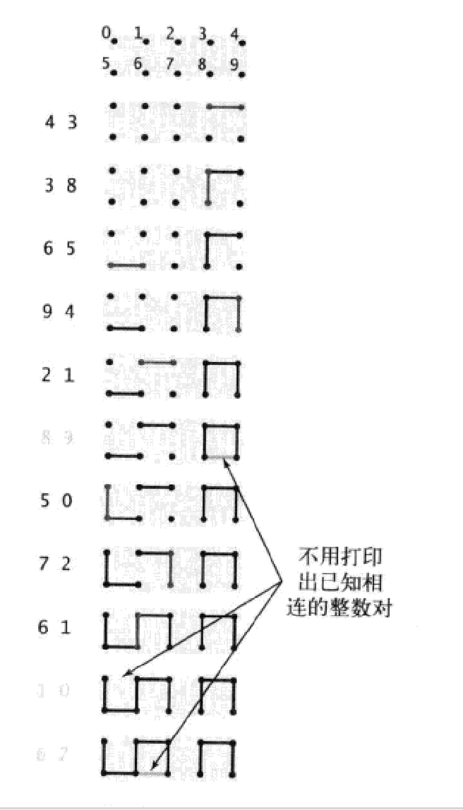

[算法 (第四版)](https://book.douban.com/subject/19952400/ "算法 (第四版)") 是一本经典的算法入门教材.

原书中的代码全部用 Java 实现. 我在阅读过程中把其中的 Java 代码转译成了 PHP 实现. 一方面是为了通过手动敲代码, 加深对内容的理解. 另一方面, 也是为了方便自己以后 PHP 的算法面试复习.

把 Java 转成 PHP 这种工作, 在现实中可能没有多大意义. 这个项目纯粹出于个人目的, 自然也希望能对其他程序员能有所帮助.

项目的 wiki 整理了书中每个章节的要点. wiki 中对于上下文相关的代码也给出了链接.
Wiki: <https://github.com/UniFreak/Algs4PhpCodeNote/wiki>

项目的代码都经过我本地测试运行 (MacOS, PHP7.2) 通过. 你可以下载项目, 运行代码查看每个算法的输入和输出效果.

# 关于代码

## 结构

代码并没有按照章节划分 (后续打算整理到各章节).

由于 Java 的很多特性 PHP 并不支持, 所以编码过程中, 对有些特性进行了 Mock, 另外一些特性则使用 PHP 中的变通方式. 
- StdIn

## 注释:

p. 成本模型 
% 命令运行效果
@coodie
@see
@todo
@note

lgN and logN

## Mock

IteratorTrait
StdIn --> Usage: ctrl+D (Evaluate.php), is_null 检查提前跳出 isEmpty
StdRandom
polyfill: 
    Fixed size and type array: Arr
    HashCode
    run_main
泛型, 数字索引, 定容数组  --> Arr $type 参数 -> @FixedCapacityStack.php


# 学习

Wiki 作为大纲. 具体到算法主要在代码注释中: 
- @see p.
- 讲解, 性能
- 命题, 证明
- 成本模型

# 相关资源

- <https://algs4.cs.princeton.edu/code/>

# TODO

没有将代码根据章节组织, 应该以 README 中的 @see 为导向

ClassMap?

API table

- 表格?
- Math Expression: <https://github.com/leegao/readme2tex>
- _underscore_ not working in README.md
- fill @todo
- search @?
- wiki pages
- @see 图
- 重新组织类层次和代码

行文:
- 问题, 用例
- 解答 (数据结构, 算法, 命题, 扩展)
- 比较, 类结构

# 基础

算法能在任何计算机上用任何语言实现
数据结构是算法的副产品或是结果
不应该使用资源消耗情况未知的算法

## 基础编程模型

编写递归代码注意:
- 递归总有一个**最简单的情况**
- 递归调用总是去尝试解决一个**规模更小**的子问题, 这样才能**收敛**最简单的情况
- 递归调用的父问题和尝试解决的子问题之间不应该有**交集**

while 循环中, 递增变量再循环结束之后仍然是可用的. 这个区别常常是使用 while 而非 for (不可用) 的主要原因

## 数据抽象

定义和使用数据类型, 这个过程也被称为**数据抽象**, 它是**函数抽象**风格的补充.
抽象数据类型 (ADT) 的主要不同之处在于将数据和函数的实现关联起来, 并将数据的表示方式隐藏起来

所有对象都有三大重要特性: 状态, 标识和行为

静态方法的主要作用是实现函数, 非静态(实例)方法的主要作用是实现数据类型的操作

## 背包, 队列和栈

理解链表是学习各种算法和数据结构中最关键的一步. 在结构化存储数据集时, 链表是数组的一种重要的替代方式.
不过链表编程也会遇到各种问题, 且调试十分困难

**链表**表示的是一列元素, 不同之处在于, 在链表中向序列插入或删除元素都更便捷:
- 从表头插入和删除结点都和链表长度无关
- 在其他位置的插入和删除操作和链表长度成正比. 标准解决方案是使用**双向链表**

链表的使用达到了我们的**对栈的**最优设计目标
- 可处理任意类型数据
- 所需空间和集合大小成正比
- 操作所需时间和集合大小无关

**背包**:一种不支持从中删除元素的集合数据类型, 迭代的顺序不确定且与用例无关.

**先进先出队列(队列)**:FIFO, 入列顺序和出列顺序相同

**下压栈(栈)**:LIFO, 入列顺序和出列顺序相反. 在计算机领域, 栈具有基础而深远的影响

使用栈进行算术表达式计算, 如 (1 + ( ( 2 + 3 ) * ( 4 * 5 ) ):
1. 将操作数压栈
2. 将运算符压栈
3. 忽略左括号
4. 遇到右括号时, 弹出一个运算符, 弹出所需数量的操作数, 并将运算符和操作数的运算结果压入操作数栈 见 Evaluate.php

数组和链表这两种表示对象集合的方式, 常常被称为**顺序存储**和**链式存储**, 我们会在后面通过以下
方式扩展这两种基本数据结构:
- 扩展为含有多个链接的数据结构
- 扩展为复合型的数据结构, 如用背包存储栈, 用队列存储数组等

在研究一个新的应用领域时, 我们按以下步骤识别并使用数据抽象解决问题:
1. 定义 API
2. 根据特定应用场景开发用例代码
3. 描述一种数据结构(一组值的表示), 并在 API 所对应的抽象数据类型的实现中根据它定义类的实例变量
4. 描述算法(实现一组操作的方式), 并根据它实现类中的实例方法
5. 分析算法的性能特点

## 算法分析

性能问题:
- 程序会运行多长时间
- 会耗用多少内存

回答这些问题的过程的基础是_科学方法_.
我们会使用_数学分析_为算法成本建立简洁的模型, 并使用_实验数据_验证这些模型.

科学方法的一般过程
1. 细致_观察_真实世界, 精确测量
2. 根据观察结果提出_假设_模型
3. 根据模型_预测_未来的事件
4. 继续观察并_核实_预测的准确性
5. 如此反复直到确认预测和观察一致

科学方法的关键原则
- 设计的试验必须是_可重现_的, 这样他人也可自己验证假设
- 假设也必须是_可证伪_的, 这样我们才能确认某个假设是错误的

计算性任务的困难程度可以用_问题的规模_来衡量, 问题的规模可以是输入的大小或某个命令行参数.
如果运行时间和输入规模本身相对无关, 我们就需要进行一些试验来更好地理解并更好的控制运行时间对输入的敏感度.
你常常能在程序运行的时候就给出一个较为准确的预测 @see ThreeSum. 
准确测量给定程序的运行时间是困难的, 但我们一般只需要近似值就可以了. 
我们仍然需要准确的衡量来生成实验数据, 并根据它们得出并验证关于程序运行时间和问题规模的假设 @see Stopwatch

假设: 幂次法则
使用 Stopwatch 测量 ThreeSum 的性能, 得到的图像符合**幂次法则**, 即 T(N)=aN^b 的猜想.
许多自然和人工的现象都符合幂次法则

Knuth 认为, 原则上我们可能构造出一个**数学模型**来描述任意程序的运行时间, 一个程序运行的总时间主要和两点有关:
- 执行每条语句的耗时
- 执行每条语句的频率

对于频率的分析, 一般会产生一个多项式, 一般次多项式中, 首项之后的其他项都相对较小,
我们常用 ~ 来忽略较小的项.
我们用 ~f(N) 表示所有随着 N 的增大除以 f(N) 的结果趋近于 1 的函数 (即随着 N 增大, ~f(N) 越来越近似于 f(N)).
用 g(N)~f(N) 表示 g(N)/f(N) 随着 N 的增大趋近于 1.
一般我们用到的近似方程都是 g(N)~af(N), 其中 f(N)=N^b(logN)^c, 其中 a, b, c 都是常数,
称 f(N) 为 g(N) 的**增长数量级**

对于程序运行时间的_猜想_很重要, 因为它将抽象世界的一个程序 和真实世界中运行它的一台计算机_联系_了起来;
_增长数量级_则让我们更进一步: 将程序和它实现的算法_隔离_开来, 这使我们对算法性能的知识可以应用于任何计算机

我们观察到一个关键现象是执行最频繁的指令决定了程序执行的总时间, 我们将这些指令成为程序的**内循环**

我们用**性质**表示需要用实验验证的_猜想_.
我们用**成本模型**评估算法的性质, 这个模型定义了算法中的基本操作, 如访问数组的次数.
我们用**命题**表示在某个成本模型下算法的_数学性质_
我们会研究算法准确的数学性质(命题)并对实现的性能做出猜想(性质), 并通过实验验证这些猜想

得到程序运行时间的数学模型所需的一般步骤如下:
1. 确定_输入模型_, 定义_问题规模_
2. 识别_内循环_
3. 根据内循环中的操作确定_成本模型_
4. 对于给定的输入, 判断这些操作的执行频率. 这可能需要进行_数学分析_

理解特定的数学模型对于理解基础算法的运行效率是很关键的

常见增长数量级的分类

|描述|数量级|典型代码|举例|备注|
|------|------|------|------|------|
|常数|1|普通语句|两数相加|
|对数|logN|二分策略|二分查找|对数的底数和增长的数量级无关, 因为不同底数仅相当于一个常数因子|
|线性|N|循环|找出最大元素|
|线性对数|NlogN|分治|归并排序|在实践中非常重要|
|平方|N^2|双层循环|检查所有元素对|
|立方|N^3|三层循环|检查所有三元组|
|指数|2^N|穷举|检查所有子集|非常慢, 不可能用于解决大规模问题, 但在算法理论仍有重要地位|

了解增长数量级的一个重要动力是帮助我们设计更快的算法, 比如如何优化 ThreeSum?
- 先考虑问题的简化版本 @see TwoSum
- 使用已知的较快算法, 如归并排序(线性对数)和二分查找(对数) @see TwoSumFast
@see ThreeSumFast

我们通常按以下方式解决各种新问题:
1. 实现并分析该问题的一种简单解法, 通常称其为**暴力**算法
2. 考察算法的各种改进, 它们通常能降低算法运行时间的增长数量级
3. 用实验证明新的算法更快
我们会学习同一个问题的多种算法, 因为对于实际问题来说, _运行时间只是选择算法所要考虑的因素之一_

倍率定理
: 如果 T(N)~aN^blgN, 那么 T(2N)/T(N)~2^b

通过**倍率试验**可以简单有效的预测大部分(对比值没有极限的算法无效)程序性能, 并判断其增长数量级:
1. 开发一个输入生成器来产生实际情况下的各种可能输入 (如 @see DoublingTest::timeTrail())
2. 运行 @see DoublingRatio, 计算每次试验和上次的运行时间比值
3. 反复运行直到该比值趋近于极限 2^b (倍率定理)
4. 则增长数量级约为 N^b (比如 T(N)~8=N^b, b=3)
5. 要预测一个程序的运行时间, 将上次观察到的时间乘以 2^b 并将 N 加倍, 如此反复
在性能压力的情况下应该考虑对编写过的所有程序进行倍率试验. 如果希望预测的输入规模不是 N 乘以 2,
则可以相应的调整这个比例

性能分析时产生误导性结果的原因, 有可能是
- 大常数: 我们忽略的常数可能很大, 要对大常数保持敏感
- 非决定性的内循环: 成本模型可能需要改进
- 指令时间: 每条指令执行时间总是相同的, 这个假设并不总是正确
- 系统因素: 系统中同时运行的其他程序应该是可以忽略或可以控制的
- 不分伯仲
- 对输入的强烈依赖: 注意输入应该和运行时间相对无关
    + 更小心的为问题的输入建模, 现有输入模型可能是不切实际的
    + 保证最坏情况下的性能, 如心脏起搏器
    + 随机化算法: 如 @see 快速排序中打乱输入, 以及 @see 散列算法
    + 考虑操作序列, 如压出栈的操作序列不同, 栈的性能可能也大不相同
    + 均摊分析: 将少量昂贵操作的成本通过大量廉价操作摊平 @? p.125
- 多个问题参量

算法分析者的任务就是尽可能地解释关于某个算法的更多信息, 而程序员的任务则是利用这些信息开发有效解决现实问题的程序

## 案例研究: union-find 算法

**动态连通性问题** @see UF, QuickFindUF, QuickUnionUF, WeightedQuickUnionUF
问题输入是一列整数对, 一对整数 p 和 q 代表 "p 和 q 相连". 目标是过滤掉序列中无意义的整数对
(两个整数均来自于同一个等价类中). 我们将对象称为 **触点**, 整数对称为 **连接**,
等价类称为 **连通分量** 或简称 **分量**



这个问题有很多现实应用, 如:
- 网络: 节点之间是否有连接? 电路触电是否相连? 社交网络中两个人是否有关系?
- 变量名等价性
- 数学集合: p 和 q 是否属于不同的数学集合?

设计算法时面对的第一个任务就是精确地定义问题

数据结构的性质将直接影响到算法的效率, 因此数据结构和算法的设计是紧密相关的

本书中研究各种基础问题时都会遵循的基本步骤:
1. 完整而详细的定义问题, 找出解决问题所必须的基本抽象操作并定义一份 API
2. 简介的实现一种初级算法, 给出一个精心组织的开发用例并使用实际数据作为输入
3. 当实现所能解决的问题的最大规模达不到期望时, 决定改进还是放弃
4. 逐步改进实现, 通过经验性分析或(和)数学分析验证改进后的效果
5. 用更高层次的抽象表示数据结构或算法来设计更高级的改进版本
6. 如果可能尽量为最坏情况下的性能提供保证, 但在处理普通数据时也要有良好的性能
7. 在适当的时候将更细致的深入研究留给有经验的研究者并继续解决下一个问题

# 排序

学习排序算法三大意义:
1. 对排序算法的分析有助于全面理解比较算法性能的方法
2. 类似的技术也能有效解决其他类型的问题
3. 排序算法常常是解决其他问题的第一步

@see Sort

## 初级排序算法

学习这些初级算法的必要性:
- 它们帮助我们建立了一些基本的规则
- 它们展示了一些性能基准
- 在某些特殊情况下它们也是很好的选择
- 它们是开发更强大的排序算法的基石

选择排序 @see SelectionSort
插入排序 @see InsertionSort
希尔排序 @see ShellSort

只有研究那些最重要的算法的专家才会经历完整的研究过程, 但每个使用算法的程序员都应该了解算法的性能特性背后的科学过程.
我们通过以下步骤比较两个算法:
1. 实现并调试它们
2. 分析它们的基本性质
3. 对它们的相对性能做出猜想
4. 用实验验证我们的猜想 @see SortCompare

## 归并排序

@see
- MergeSort
    - TopDownMergeSort
    - BottomUpMergeSort

不要对算法初始实现的性能盖棺定论

**分治思想**: 将大问题分割成小问题分别解决, 然后用所有小问题的答案来解决大问题

命题: 没有任何基于比较的算法能够保证使用少于 lg(N!)~NlgN (斯特灵公式) 次比较将长度为 N 的数组排序
证明: 任意基于比较的排序算法都对应着一颗高 h 的比较树, 而这个树叶子结点数量满足以下关系:
    N! <= 叶子结点数量 <= 2^h
    之所以至少有 N! 个, 是因为 N 个不同主键会有 N! 种不同排列, 如果少于 N!, 则肯定有遗漏
    之所以至多有 2^h 个, 是因为二叉树的性质
这是一个重要结论, 适用于任何能想到的基于比较的算法. 准确的上界为软件工程师保证性能提供了空间,
而准确的下界可以避免浪费时间在不可能的性能改进上

## 快速排序

@see QuickSort, ThreeWayQuickSort

## 优先队列

**优先队列** 是一种_抽象数据类型_, 它应该支持两种操作: _删除最大元素_ 和 _插入元素_

应用场景:
- 模拟系统: 事件的键即为发生的事件, 系统需要按时间顺序处理所有事件
- 任务调度: 键值对应的优先级决定了应该首先执行哪些任务
- 数值计算: 键值代表计算错误, 需要按照键值指定的顺序修正它们
- 排序: 通过插入一列元素然后一个个的删除其中最小的元素, 实现排序算法 @see 堆排序

实现栈或是队列与实现优先队列的最大不同在于对性能的要求

初级实现: _插入_和_删除最大元素_在最坏情况下需要_线性_时间
- 可以选择使用_基于数组的下压栈_或者_基于链表的下压栈_
- 可以选择使用_惰性方法_或者_积极方法_
    + 惰性方法: 插入时和入栈操作一样. 删除时用类似选择排序的内循环交换最大元素和边界元素, 然后删除
    + 积极方法: 插入时就利用插入排序, 使栈保持有序. 删除时则和出栈操作一样

基于堆的实现: 对数级别

- @see PQ
    + MaxPQ
    + MinPQ -> TopM
    + IndexMinPQ -> Multiway

**堆排序**: @see HeapSort

## 应用

    算法     稳定    原地    时间复杂度         空间复杂度   备注    
    ================================================================================
    选择     否       是     N^2              1          取决于输入元素的排列情况    
    插入     是       是     N~N^2            1             
    希尔     否       是     NlogN?~N^(6/5)?  1    
    快速     否       是     NlogN            lgN        运行效率有概率提供保证    
    三向快速  否       是     N~NlogN          lgN        运行效率有概率保证,
                                                        同时也取决于输入元素的分布情况    
    归并     是       否     NlogN             N        
    堆       否       是     NlogN            1        


排序应用一览
- 商业计算
- 信息搜索: 有序能确保使用经典的二分查找算法
- 运筹学: 调度, 负载均衡
- 事件驱动模拟 @see c.6.0.1
- 数值计算: 使用优先队列和排序控制计算中的精确度
- 组合搜索: A* 算法
- Prim / Dijkstra / Kruskal / 霍夫曼压缩 / 字符串处理

# 查找

## 符号表

**符号表 (Symbol Table)**: 是一种存储键值对的数据结构, 支持两种操作: _插入(put)_, 即将一组新的键值对存入表中;
    _查找(get)_, 即根据给定的键得到相应的值
**有序符号表**: 会保持_键的有序_的符号表

设计决策
- 重复的键. 这些规则定义了**关联数组**的抽象形式
    + 每个键只对应着一个值 (表中不允许存在重复的键)
    + 当用例代码向表中存入的键值对和表中已有的键 (及关联的值) 冲突时, 新的值会替代旧的值
- 键和值都不能为 null
- 删除的实现可以有两种方法: _延时删除_或_即时删除_. 本书的实现采用即时删除
- 我们定义了 keys() 方法返回一个 Iterable 对象以方便用例遍历所有的键, 这么做是为了和以后的有
  序符号表的所有方法保持一致
- 为了维护_对象等价性_, 最好使用不可变的数据类型作为键, 否则表的一致性是无法保证的

查找的成本模型
- 统计_比较_的次数 (等价性测试或是键的相互比较)
- 在内循环不进行比较 (极少) 的情况下, 统计_数组的访问次数_

用例约定
- 在用例代码中, 除非想使用一个特定的实现, 否则都会使用 ST 表示一个符号表实现
- @todo 行为测试用例 S 是键, 0 是值. 键可以是任何可比较的数据类型, 不要局限于数值
- @todo 性能测试用例 @see FrequencyCounter -> 评估两种初级的符号表实现

实现
- 基于链表的_顺序查找_ (一个一个地顺序遍历符号表中的所有键并测试是否相等来寻找与被查找键匹配的键)
  @see SequentialSearchST
- 基于有序数组的_二分查找_ @see BinarySearchST

性能分析
- 比分析排序更困难, 因为不同的用例所进行的操作序列各不相同
- 但它们的使用肯定不是随机的, _因此我们主要研究最坏情况下的性能_
- _命中_表示一次成功的查找, _未命中_表示一次失败的查找

由于 PHP 语言限制: 没有泛型, 没有 Comparable 接口, 没有私有类
- equals() 用 == 代替
- 私有类放到一个文件内
- PHP 中, 0 == null, 所以这里一定要用全等

符号表各种实现的优缺点:

    数据结构         实现                   优点                    缺点  
    ===================================================================================
    链表(顺序查找)    SequentialSearchST    适用于小型问题            对于大型符号表很慢  
    有序数组(二分查找) BinarySearchST        最优的查找效率和空间需求   插入操作很慢     
                                          能进行有序性操作          没有性能上界保证, 额外空间   
    二分查找树        BST                   实现简单, 有序性操作      
    平衡二叉查找树    RedBlackBST           最优的查找和插入效率        额外空间
                                          有序性操作       
    散列表           SeparateChainHashST   快速查找和插入常见类型的数据 需计算散列
                    LinearProbingHashST                            无法进行有序性操作
                                                                   额外空间  
                             

## 二叉查找树

将链表插入的灵活性和有序数组查找的高效性结合起来. 具体来说, 就是使用每个结点含有_两个_链接
(链表中每个结点只含有一个链接)

我们所使用的的数据结构由**结点**组成, 结点包含的**链接**可以为空 (null) 或者指向其他结点. 在
**二叉树**中, 每个结点只能有一个父结点 (**根节点**例外, 它没有父节点), 而且每个结点都只有左右
两个链接, 分别指向自己的**左子结点**和**右子结点**. 一颗**二叉查找树(BST)**是一颗二叉树, 其中
每个结点都含有一个可比较的键(以及相关联的值), 且每个节点的键都大于其左子树中的任意结点的键而小于
右子树的任意结点的键

## 平衡查找树


一颗**2-3查找树**或为一颗空树, 或由以下结点组成:
- **2-结点**, 含有一个键(及其对应的值)和两条链接, 左链接指向的 2-3 树中的键都小于该结点,
  右链接指向的 2-3 树中的键大于该结点
- **3-结点**, 含有两个键(及其对应的值)和三条链接, 左链接指向的 2-3 树中的键都小于该结点, 中链接指向
  指向的 2-3 树中的键都位于该结点的两个键之间, 右链接指向的 2-3 树中的键都大于该结点
和以前一样, 将指向一棵空树的链接称为**空连接**. 一颗**完美平衡**的 2-3 查找树中的所有空链接
到根节点的距离应该是相同的. 我们用 _2-3 树_ 指代一颗完美平衡的 2-3 查找树

2-3 树的分析和二叉查找树的分析大不相同, 我们主要感兴趣的是_最坏情况下_的性能, 而非_一般情况_ (这种
情况下我们会用随机键模型分析预期的性能)

命题 p.273
- F: 在一颗大小为 N 的 2-3 树中, 查找和插入操作访问的结点必然不超过 lgN 个
  证明: 一个含有 N 个结点的 2-3 树的高度在 ⌊log₃N⌋=⌊(lgN)/(lg3)⌋ (如果树中全是 3-结点) 和
  ⌊lgN⌋ (如果树中全是 2-结点) 之间

操作步骤 @todo?

尽管可以用不同的数据类型表示 2-结点和 3-结点, 但这种直白的表示方法实现大多数的操作并不方便, 因为
需要处理的情况太多. 这种实现所产生的的额外开销可能会使算法比标准的二叉查找树更慢. 因此引入
**红黑二叉查找树**数据结构来表达并实现它

**红黑二叉查找树**基本思想是用标准的二叉查找树 (完全由 2-结点构成) 和一些额外的信息 (替换 3-结点)
来表示 2-3 树. 我们将树中的链接分为两种类型: **红链接**将两个 2- 结点连接起来构成一个 3-结点,
**黒链接**则是 2-3 树中的普通链接. 即将一个 3-结点表示如下 (`//` 代表红链接).

        a  b                              b
      /   |  \                          //  \
    <a   a~b  >b       --->            a    >b
                                     /  \
                                    <a  a~b

用这种方式表示 2-3 树的二叉查找树称为 **红黑二叉树查找树** (简称 **红黑树**). 可以看到, 将红链接
画平时, 一颗红黑树就是一颗 2-3 树. 红黑树既是二叉查找树, 也是 2-3 树. 它将二叉查找树中简洁高效的
查找方法和 2-3 树中高效的平衡插入算法结合了起来

## 散列表

使用散列表的查找算法分两步:
1. 用_散列函数_将被查找的键转化为数组的一个索引
2. _处理碰撞冲突_: _拉链法_ @see SeparateChianingHashST 和_线性探测法_ @see LinearProbingHashST

散列表是算法在_时间和空间上做出权衡_的经典例子. 散列表使用了适度的空间和时间并在这两个极端之间找到
了一种平衡. 我们不必重写代码, 只需调整散列算法的参数就可以在空间和时间之间做出取舍. 使用散列表, 可
以实现在一般应用中拥有 (均摊后) _常数级别_的查找和插入操作的符号表. 这使得它在很多情况下成为简单
符号表的最佳选择

_散列函数_应该易于计算并能够均匀分布所有的键. 散列函数和键的类型有关, 严格地说, 对于每种类型的键
都需要一个与之对应的散列函数. 例如
- 形如 123-45-6789 的社会保险号: 用所有 9 个数字得到一个整数, 再考虑整数的散列函数
- 正整数: 最常用方法是_除留余数法_, 如果使用素数, 散列值的分布会更好
- 浮点数 (0~1 之间的实数): 将键表示为二进制数然后再使用除留余数法
- 字符串: 将字符串当做一个 N 位的 R 进制值, 然后使用 _Horner方法_

    ```php
    $hash = 0;
    for ($i = 0; $i < mb_strlen($s); $i++) {
        // 获取字符对应的数值
        $ord = mb_ord(mb_substr($s, $i, 1));
        // R 需要足够小, 不造成溢出
        // M 使用较小的素数, 能保证所有字符都能发挥作用
        $hash = ($R * $hash + $ord) % $M;
    }
    ```

- 组合键: 比如含有几个整型域的 Date

    ```php
    $hash = ((($this->day * $R + $this->month) % $M) * $R + $this->year) % $M;
    ```

如果散列值的计算很耗时, 可以考虑使用**软缓存**, 比如将每个键的散列值在第一次计算之后存入 hash 变量

优秀的散列方法需要满足三个条件:
- _一致性_ -- 等价的键必然产生相等的散列值
- _高效性_ -- 计算便捷
- _均匀性_ -- 均匀地散列所有的键
糟糕的散列函数经常是性能问题的罪魁祸首, 在有性能要求时应该谨慎使用散列, 并且测试所使用的所有散列函数,
以知道计算散列函数和比较两个键, 哪个耗时更多

设计散列函数时, 应尽量避免随意指定参数以防止大量的碰撞

假设 p.296
- J (均匀散列假设): 我们使用的散列函数能够均匀平独立的将所有的件散布于 0 到 M-1 之间
  讨论: 理论研究告诉我们想要找到一个计算简单但又能拥有一致性和均匀性的散列函数是不太可能的. 实际
  应用中, 大多数程序员会满足于随机数生成器类的散列函数. 很少有人会去检验独立性, 而这个性质一般不
  会满足

在实践中, 两种方法在内存使用上的差别主要是因为拉链法为每个键值对都分配了一小块内存, 而线性探测则为整张表
使用了两个很大的数组.

令 α=N/M, 则在拉链法中, α 是每条链表的长度, 在线性探测法中, α 是已被占用的空间的比例, 称为_使用率_

散列后键的顺序信息就丢失了, 如果需要有序性相关的操作, 散列表不是合适的选择. 在键的顺序并不重要的应用中,
它可能是最快的 (也是使用最广泛的) 的符号表实现

## 应用

每当使用一个名称来指代某种东西时, 都用到了符号表

对于典型的应用程序, 应该在散列表和二叉查找树之间进行选择
- 散列表的代码更简单, 查找时间最优
- 二叉查找树抽象结构更简单
- 红黑树可保证最坏情况性能, 支持有序性操作
多数程序员第一选择都是散列表, 在其他因素更重要时才选择红黑树

SET: 无需处理具体值, 只需检测键在表中是否存在. 分为有序和无序两个版本. 用例
- DeDup: 去掉输入流中重复项
- WhiteFilter: 好友列表; BlackFilter: 垃圾邮件

字典类应用: 每个键都有一个与之关联的值 @see LookupIndex

|应用|键|值|
|------|------|------|
|电话黄页|人名|电话号码|
|字典|单词|定义|
|账户信息|账号|余额|
|基因组|密码子|氨基酸|
|实验数据|数据/时间|实验结果|
|编译器|变量名|内存地址|
|文件共享|歌曲名|计算机|
|DNS|网站|IP 地址|

索引类应用: 一个键和多个值相关联的符号表 @see FileIndex

|应用|键|值|
|------|------|------|
|基因组学|氨基酸|一系列密码子|
|商业交易|账号|一系列交易|
|网络搜索|关键字|一系列网页|
|IMDB|电影|一系列演员|

**反向索引**: 用值来查找键的操作

**稀疏向量**: @see SparseVector

@todo
- SET, HashSET p.314
- Dedup, WhiltFilter p.315
- LookupCSV p.318
- LookupIndex p.321
- FileIndex p.322
- SparseVector p.323

# 图

图的典型应用

|应用|结点|连接|
|------|------|------|
|地图|十字路口|公路|
|网络内容|网页|超链接|
|电路|元器件|导线|
|任务调度|任务|限制条件|
|商业交易|客户|交易|
|配对|学生|申请|
|计算机网络|网站|物理连接|
|软件|方法|调用关系|
|社交网络|人|友谊关系|

## 无向图

**图**是由一组_顶点_和一组能够将两个顶点相连的_边_组成的. 一般用 0 至 V-1 表示一张含有 V 个顶点
的图的各个顶点. 用 v-w 表示连接 v 和 w 的边, w-v 是这条边的另一种表示方法. **自环** 即一条连接
一个顶点和其自身的边. 连接同一对顶点的两条边称为**平行边**. 数学家常常将含有平行边的图称为**多重图**,
而将没有平行边或自环的图称为**简单图**.

在图中, **路径**是由边顺序连接的一系列顶点. **简单路径**是一条没有重复顶点的路径. **环**是一条至少
含有一条边且起点和终点相同的路径. **简单环**是一条 (除了起点和终点必须相同之外) 不含有重复顶点和边的环.
**无环图**是一种不包含环的图. 路径或者环的**长度**为其中所包含的边数.

如果从任意一个顶点都存在一条路经到达另一个任意顶点, 称这幅图是**连通图**. 一幅**非连通的图**由若干连通的
部分组成, 它们都是其**极大连通子图**. 一般来说, 要处理一张图就需要一个个的处理它的连通分量 (子图).

**树**是一幅无环连通图. 当且仅当一副含有 V 各结点的图 G 满足下列 5 个条件_之一_时, 它就是一棵树
- G 有 V-1 条边切不含有环
- G 有 V-1 条边且是连通的
- G 是连通的, 但删除任意一条边都会使它不再连通
- G 是无环图, 但添加任意一条边都会产生一条环
- G 中的任意一对顶点之间仅存在一条简单路径
以上这些性质在分析和实现寻找生成树和森林算法时扮演者重要角色

互不相连的树组成的集合称为**森林**. 连通图的**生成树**是它的一幅子图, 它含有
图中所有定点且是一棵树. 图的**生成树森林**是它的所有连通子图的生成树的集合.

图的**密度**指已经连接的顶点对占所有可能被连接的顶点对的比例. 在**稀疏图**中, 被连接的顶点对很少;
而在**稠密图**中, 只有少部分顶点队之间没有边连接. 我们将会遇到的应用使用的几乎都是稀疏图. **二分图**
是一种能够将所有结点分为两部分的图, 其中图的每条边所连接的两个顶点都分别属于不同的部分 (比如电影和
演员关系图).

三种图的_表示方法_:
- **邻接矩阵**: V 乘 V 的布尔矩阵, 当有 v-w 连接时, 定义 v 行 w 列的元素值为 true.
    缺点: V^2 个布尔矩阵所需空间太大; 无法表示平行边.
- **边的数组**: 使用一个 Edge 类, 它含有两个 int 实例变量
    缺点: 如果要查找和 v 相连的所有顶点, 需要遍历图中所有的边.
- **邻接表数组**: 以顶点为索引的列表数组, 其中的每个元素都是和该顶点相邻的顶点列表.
    这也是非稠密图的标准表示. 它支持平行边和自环. 它具有如下性能特点:
    + 使用的空间和 V+E 成正比
    + 添加一条边所需时间为常数
    + 遍历顶点 v 的所有相邻顶点所需时间和 v 的度数成正比

图的处理算法 @see
- Graph -> Digraph
- Search
    + UF
    + DepthFirstSearch -> DirectedDFS
- Paths
    + DepthFirstPaths -> DepthFistDirectedPaths
    + BreadthFirstPaths -> BreadthFirstDirectedPaths
- CC

深度优先算法 (DFS) 是本章好几种图算法的基础, 这种简单的递归模式只是一个开始, DFS 能有效处理许多和图有关的任务:
- 连通性: 两个给定的顶点是否连通 (路经检测) @see Search
- 单点路径 / 最短路径: 找出从 s 到给定目的顶点 v 的路径 @see Paths
- 连通分量: 找出一幅图的所有连通分量 @see CC
- 检测环: 给定的图是无环图吗 @see Cycle
- 双色问题: 能够用两种颜色将图中所有顶点着色, 使得任意一条边的两个端点的颜色都不相同吗. 即: 这是
  一副二分图吗 @see TwoColor


但 DFS 遍历整个图的顺序和找出最短路径的目标没有任何关系. 解决最短路径问题的经典方法是 **广度优先搜索**
(BFS) @see BreadthFirstPaths: 要找到从 s 到 v 的最短路径, 从 s 开始, 在所有由一条边就可以
达到的顶点中寻找 v, 如果找不到我们就继续在与 s 距离两条边的所有顶点中查找 v, 如此一直进行.
DFS 好像一个人在走迷宫, BFS 则好像是一组人在一起朝各个方向走出这座迷宫

宽度优先算法 (BFS) 能帮助解决以下问题:
- 最短路径 @see BreadthFirstPaths
- 间隔度数 @see SymbolGraph, DegreeOfSeparation
  间隔度数的理论在计算机网络的设计以及理解各个学科领域中的自然网络中都能起到重要的作用

通常, 理解算法的最好方法是在一个简单的例子中跟踪它的行为

## 有向图

考虑了边的方向以及权重之后, 同样的问题会变的困难很多, 但上一节的算法仍然奏效并成为解决更加复杂问题的起点

一幅有**方向性的图** (或**有向图**) 是由一组**顶点**和一组有**方向的边**组成的, 每条有方向的边
都连接着有序的一对顶点. 这种_组合性_的结构对算法有深刻的影响, 使的有向图和无向图的处理大有不同.

我们称一条有向边由第一个顶点**指出**并**指向**第二个顶点. 顶点的**出度**为该顶点指出的边的总数,
**入度**为指向该顶点的边的总数. 一条有向边的第一个顶点称为它的**头**, 第二个顶点称为它的**尾**.

**有向路径**由一系列定点组成, 对于其中的每个顶点都存在一条有向边从它指向序列中的下一个顶点. **有向环**
为一条至少含由一条边且起点和终点相同的有向路径. **简单有向环**是一条 (除了起点和终点必须相同之外)
不含有重复的顶点和边的环. 路径或环的长度即为其中所包含的边数.

和无向图一样, 我们假设有向路径都是简单的, 且本节的代码也能处理自环和平行边, 但它们不会出现在例子中.
我们约定, 每个顶点都能够**达到**它自己, 在有向图中 v 能够到达 w 并不意味着 w 也能到达 v.

你必须理解有向图中的_可达性_和无向图中的_连通性_的区别. 尽管你可能一眼就能看出一副小无向图中的两个顶点
之间是否连通, 但在一幅有向图中快速找出一条有向路径就不那么容易了.

实际生活中的典型有向图

|应用|顶点|边|
|------|------|------|
|食物链|物种|捕食关系|
|互联网连接|网页|超链接|
|程序|模块|外部引用|
|手机|电话|呼叫|
|学术研究|论文|引用|
|金融|股票|交易|
|网络|计算机|网络连接|

我们用跟无向图相同的邻接表来表示一个有向图. 不同的是有向图中每条边都只会出现一次. 这个区别在有向
图的处理中影响深远 @see Digraph

**可达性**: @see DepthFirstSearch -> DirectedDFS
- **单点可达性**: 是否存在一条从 s 到达给定顶点 v 的有向路径?
- **多点可达性**: 是否存在一条从集合中的任意顶点到达给定顶点 v 的有向路径?
在解决经典的字符串处理问题时会再次遇到这个问题.
因为每条边都只会被表示一次, DFS 本质上是一种适用于处理有向图的算法

多点可达性的一个重要实际应用是在典型的内存管理系统中, 包括许多 Java 的实现. 在一幅有向图中, 一个
顶点表示一个对象, 一条边则表示一个对象对另一个对象的引用. **标记-清除的垃圾回收策略** 会为每个对象
保留一个为做垃圾收集之用. 它会周期性地运行一个类似于 DirectedDFS 的有向图可达性算法来标记所有可以
被访问到的对象, 然后清理所有对象, 回收没有被标记的对象

**寻路**:
@see DepthFirstPaths -> DepthFirstDirectedPaths, BreadthFirstPaths -> BreadthFirstDirectedPaths
- **单点有向路径**: 从 s 到给定目的顶点 v 是否存在一条有向路径, 并找出
- **单点最短有向路径**: 从 s 到给定目的顶点 v 是否存在一条有向路径, 并找出最短的那条

**有向无环图 (DAG)** 就是一幅不含有有向环的有向图.

**有向环检测**: 给定的有向图中包含有有向环吗? 如果有则按照路径方向从某个顶点开始并返回自己来找到
环上的所有顶点. 相当于回答 "一幅有向图是 DAG 吗" 这个问题. 一幅有向图中含有的环的数量可能是图的
大小的指数级别, 因此只需找出一个环即可, 而不是所有环.
基于 DFS 解决这个问题并不困难, 因为系统维护的递归调用的栈表示的正是 "当前" 正在遍历的有向路径.
一旦我们找到了一条有向边 v->w 且 w 已经存在于栈中, 就找到了一个环, 因为栈表示的是一条由 w 到 v
的有向路径, 而 v->w 正好补全了这个环. 反之如果没有找到这样的边, 则意味着这幅有向图无环. @see
Cycle -> DirectedCycle

在和有向图相关的实际应用中, 有向环特别重要. 一种应用广泛的模型是给定一组任务并安排它们的执行顺序,
_限制条件_是这些任务的执行方法和起始时间, 还可能包括任务的时耗以及消耗的其他资源. 最重要的一种限制
条件叫做_优先级限制_, 它指明了哪些任务必须在哪些任务之前完成. 不同的限制条件会产生不同的调度问题.
这个问题等价于拓扑排序.

**拓扑排序**: 给定一幅有向图, 将所有的顶点排序, 使得所有的有向边均从排在前面的元素指向排在后面的元素.
(或者说明无法做到这一点. 一般来说, 如果一个有优先级限制的问题中存在有向环, 那么这个问题无解).

实际上, 我们已经见过一种拓扑排序算法: 只要添加一行代码, 标准深度优先搜索程序就能完成这项任务
@see DepthFirstSearch -> DepthFirstOrder -> Topological, SymbolDigraph

实际应用中, 拓扑排序和有向环检测总是一起出现. 因为有向环的检测是拓扑排序的前提. 因此解决任务调度
类的问题通常需要三部:
1. 指明任务和优先级条件
2. 不断检测并去除有向图中的所有环, 以确保存在可行方案 @see DirectedCycle
3. 使用拓扑排序解决调度类问题 @see Topological
调度方案的任何变动之后都需要再次检查是否存在环, 然后在计算新的调度安排

拓扑排序的典型应用

|应用|顶点|边|
|------|------|------|
|任务调度|任务|优先级限制|
|课程安排|课程|先导课程限制|
|继承|Java 类|extends 关系|
|电子表格|单元格|公式|
|符号链接|文件名|链接|

如果两个顶点 v 和 w 是互相可达的, 则称它们为 **强连通** 的. 也就是说, 既存在一条从 v 到 w 的
有向路径, 也存在一条从 w 到 v 的有向路径. 如果一幅有向图中的任意两个顶点都是强连通的, 则称这幅
有向图也是 **强连通** 的.

环在强连通性的理解上起着重要的作用: 当且仅当两个顶点都在一个普通的有向环中时, 它们才是强连通的.

强连通性将所有顶点分为了一些等价类, 每个等价类都是由相互均为强连通的顶点的最大子集组成的. 我们将
这些子集称为 **强连通分量**. 一个含有 V 个顶点的有向图含有 1 ~ V 个强连通分量 -- 一个强连通图
中只含有一个强连通分量, 而一个有向无环图中则含有 V 个强连通分量.

**强连通性问题**: 给定的两个顶点是强连通的吗? 这幅有向图含有多少个强连通分量?
@see CC -> KosarajuCC

**顶点对的可达性问题**: 是否存在一条从一个给定的顶点 v 到另一个给定的顶点 w 的路径?
对于无向图, 这个问题等价于连通性问题. 对于有向图, 它和强连通性的问题有很大区别.

有向图 G 的 **传递闭包** 是由相同的一组顶点组成的另一幅有向图, 在传递闭包中存在一条从 v 指向 w
的边当且仅当在 G 中 w 是从 v 可达的. 因为传递闭包一般都很稠密, 通常将它们表示成一个布尔值矩阵.
@see TransitiveClosure

## 最小生成树 (Minimum Spanning Trees)

**加权图** 是一种为每条边关联一个_权值_或是_成本_的图模型. 图的 **生成树** 是它的一颗含有其所有
顶点的无环连通子图. 一幅加权图的**最小生成树(MST)**是它的一颗权值 (树中所有边的权值之和) 最小的
生成树

MST 的典型应用

|应用领域|顶点|边|
|------|------|------|
|电路|元器件|导线|
|航空|机场|航线|
|电力分配|电站|输电线|
|图像分析|面部容貌|相似关系|

本节约定如下
- 只考虑连通图: 如果一幅图是非连通的, 我们只能使用算法计算它的所有连通分量的 MST, 合在一起称为
  **最小生成森林**
- 边的权重不一定表示距离: 也可能表示时间, 费用或其他变量, 而且也不一定会和距离成正比
- 边的权重可能是 0 或者负数
- 所有边的权重都各不相同: 如果边的权重可以相同, MST 就不一定唯一了, 这会是算法证明变复杂. 实际上
  这个假设并没有限制算法的适用范围, 因为不做修改它们也能处理存在等值权重的情况

回忆 C4.1 中树的性质
- 用一条边连接树中的任意两个顶点都会产生一个新的环
- 从树中删去一条边将会得到两可独立的树
这两条性质是证明 MST 的另一个基本性质 (切分定理) 的基础. 而由切分定理就能得到本节 MST 的生成算法

图的一种**切分**是将图的所有顶点分为两个非空且不重叠的两个集合. **横切边**是一条连接两个属于不同
集合的顶点的边

命题: p.392
- J (**切分定理**): 在一幅加权图中, 给定任意的切分, 它的横切边中的权重最小者必然属于图的 MST
  证明: 今 e 为权重最小的横切边, T 为图的最小生成树. 我们采用反证法: 假设 T 不包含 e. 那么如果
  将 e 加入 T, 得到的图必然含有一条经过 e 的环, 且这个环至少含有另一条横切边 -- 设为 f, f 的
  权重必然大于 e (因为 e 的权重是最小的且图中所有边的权重均不相同). 那么我们删掉 f 而保留 e 就
  可以得到一颗权重更小的生成树. 这和我们的假设 T 矛盾.
- K (**MST 的生成算法**): 下面这种方法会将含有 V 个顶点的任意加权连通图中属于 MST 的边标记为
  黑色: 初始状态下所有边均为灰色, 找到一种切分, 它产生的横切边均不为黑色. 将它权重最小的横切边
  标记为黑色. 反复, 知道标记了 V-1 条黑色边为止
  证明: 为了简单, 我们假设所有边的权重均不相同, 尽管没有这个假设该命题同样成立. 根据切分定理, 所
  有被标记为黑色的边均属于 MST. 如果黑色边的数量小于 V-1, 必然还存在不会产生黑色横切边的切分 (
  因为我们假设图是连通的). 只要找到了 V-1 条黑色的边, 这些边组成的就是一颗 MST

注意, 权重最小的横切边不一定是所有横切边中唯一属于图的 MST 的边. 实际上, 许多切分都会产生若干条
术语 MST 的横切边

切分定理是解决 MST 的所有算法的基础. 跟确切的说, 这些算法都是一种 **贪心算法** 的特殊情况: 使用
切分定理找到 MST 的一条边, 不断重复直到找到 MST 的所有边. 这些算法相互之间的不同之处在于保存切分
和判定权重最小的横切边的方式, 但它们都是以下性质的特殊情况:

加权无向图数据类型的表示 (通过扩展 C4.1 对无向图的表示)
- 在邻接矩阵的表示中, 可以用边的权重代替布尔值来作为矩阵的元素
- 在邻接表的表示中, 可以在链表的结点中增加一个权重域
- 本节使用 @see Edge & EdgeWeightedGraph 数据类型表示

MST 的表示
- 一组边的列表
- 一幅加权无向图
- 一个以顶点为索引且含有父结点链接接的数组
- 本节使用 @see MST 数据类型表示

**欧几里得图**: 顶点都是平面上的点, 边为连接它们的线段且权重为两点之间的欧几里得距离

生成 MST 的两种算法
- **Prim 算法**: 它的每一步都会为一棵生长中的树添加一条边, 每次总是将下一条连接树中的顶点与不在
  树中的顶点且权重最小的边 (黑色表示) 加入树中 (即由树中的顶点所定义的切分中的一条横切边)
  @see LazyPrimMST, PrimMST
- **Kruskal 算法**: 主要思想是按照边的权重 (从小到大) 处理他们. 将边加入 MST 中, 加入的边不会
  与已经加入的边构成环, 知道树中含有 V-1 条边为止. 这些加入的边逐渐由一片森林合并为一棵树, 也就是
  MST
  @see KruskalMST

命题: p.398, p.405
- L: Prim 算法能够得到任意加权连通图的最小生成树
  证明: 由命题 K 可知, 这颗不断生长的树定义了一个切分且不存在黑色的横切边. 该算法会选取权重最小的
  横切边且根据贪心算法不断将它们标记为黑色.
- O: Kruskal 算法能够计算任意加权连通图的最小生成树
  证明: 由命题 K 可知, 如果下一条将被加入 MST 中的边不会和已有的黑色边构成环, 那么它就跨越了
  由所有和树顶点相邻的顶点组成的集合以及它们的补集所构成的一个切分. 因为加入的这条边不会形成环,
  它是目前已知的唯一一条横切边且是按照权重顺序选择的边, 所以它必然是权重最小的横切边. 因此, 该
  算法能够连续选择权中最小的横切边, 和贪心算法一致

各种 MST 生成算法性能特点

|算法|空间|时间|
|------|------|------|
|延时的 Prim 算法|E|ElogE|
|即时的 Prim 算法|V|ElogV|
|Kruskal|E|ElogE|
|Fredman-Tarjan|V|E+VlogV|
|Chazelle|V|非常接近但还没达到 E|
|理性情况|V|E?|

Prim 和 Kruskal 算法不能处理有向图 (**最小树形图** 问题)

## 最短路径 (加权有向图)

最短路径的典型应用

|应用|顶点|边|
|------|------|------|
|地图|交叉路口|公路|
|网络|路由器|网络连接|
|任务调度|任务|优先级限制|
|套汇|货币|汇率|

**单点最短路径问题**: 给定一幅加权有向图和一个起点 s, 回答 "从 s 到给定目的顶点 v 是否存在一条
有向路径? 如果有, 找出最短 (总权重最小) 的那条"

**最短路径树 (SPT)**: 以 s 为起点的一颗最短路径树是图的一副子图, 它包含有 s 和从 s 可达的所有
顶点. 这棵树的根结点为 s, 树的每条路径都是有向图中的一条最短路径. 其表示方法为一组指向父结点的链接

- 有环, 权重非负: @see Dijkstra
- 无环, 权重可负: @see AcyclicSP
- 有环, 权重可负: @see Bellman-Ford

本节假设:
- 图都是强连通图 (每个顶点从另外任意一个顶点都是可达的)
- 最短路径一般都是简单的: 我们会忽略构成环的零权重边, 因此找到的最短路径都不含有环
- 隐式的假设平行边不存在

数据类型
- 加权有向边 @see DirectedEdge
- 加权有向图 @see EdgeWeightedDigraph

SP (单点最短路径) 数据结构
- SPT 中的边: 使用一个由顶点索引的 DirectedEdge 对象的父链接数组 edgeTo[], 其中 edgeTo[v]
  的值为树中连接 v 和它的父结点的边 (也是从 s 到 v 的最短路径上的最后一条边)
- 到达起点的距离: 由顶点索引的数组 distTo[], 其中 distTo[v] 为从 s 到 v 的已知最短路径的长度
约定: edgetTo[s] 的值为 null, distTo[s] 的值为 0; 起点到不可达的顶点距离均为无限大

最短路径的实现均基于一个被称为 **松弛** 的简单操作: **放松** 边 v->w 意味着检查从 s 到 w 的
最短路径是否是先从 s 到 v, 然后再由 v 到 w. 如果是, 则根据这个情况更新数据结构的内容. 由 v
到 w 的最短路径是 distTo[v] 与 e->weight() 之和 -- 如果这个值不小于 distTo[w], 则称这条边
**失效** 了并将它忽略; 如果这个值更小, 就更新数据.

放松操作之后, 可能出现两种情况
- 边失效, 不更新任何数据
- v->w 就是到达 w 的最短路径, 这将会更新 edgeTo[w] 和 distTo[w] \(这可能会使另一些边失效,
  但也可能产生一些新的有效边)

_松弛_ 这个于用一根橡皮筋沿着连接两个顶点的路径紧紧展开的比喻: 放松一条边类似于将橡皮筋转移到一
条更短的路径上, 从而缓解了橡皮筋的压力

命题: p.420, p.421
- P (最短路径的最优性条件): 令 G 为一幅加权有向图, 顶点 s 是 G 中的起点, distTo[] 是一个由
  顶点索引的数组, 保存的是 G 中路径的长度. 对于从 s 可达的所有顶点 v, distTo[v] 的值是从 s
  到 v 的 _某条_ 路径的长度, 对于从 s 不可达的所有顶点 v, 该值为无穷大. 当且仅当对于从 v 到
  w 的任意一条边 e, 这些值都满足 distTo[w] <= distTo[v] + e->weight() 时 (换句话说, 不
  存在有效边时), 它们是 _最短_ 路径的长度
  证明: 略
- Q (通用最短路径算法): 将 distTo[s] 初始化为 0, 其他 distTo[] 元素初始化为无穷大, 继续如
  下操作: _放松 G 中的任意边, 直到不存在有效边为止_. 对于任意从 s 可达的顶点 w, 在进行这些操
  作之后, distTo[w] 的值即为从 s 到 w 的最短路径的长度 (且 edgeTo[w] 的值即为该路径上的最
  后一条边)
  证明: 放松边 v->w 必然会将 distTo[w] 的值设为从 s 到 w 的某条路径的长度 (且将 edgeTo[w]
  设为该路径上的最后一条边). 对于从 s 可达的任意顶点 w, 只要 distTo[w] 仍然是无穷大, 到达 w
  的最短路径上的某条边肯定仍然是有效的, 因此算法的操作会不断继续, 直到由 s 可达的每个顶点的
  distTo[] 值均变为到达该顶点的某条路径的长度. 对于已经找到最短路径的任意顶点 v, 在算法的计算
  过程中 distTo[v] 的值都是从 s 到 v 的某条 (简单) 路径的长度且必然是单调递减的. 因此, 它递
  减的次数必然是有限的 (每切换一条 s 到 v 简单路径就递减一次). 当不存在有效边的时候, 命题 P
  就成立了

命题 P 的一个重要的实际应用是最短路径的验证. 最短路径的算法可能很复杂, 因此能够快速验证计算的结
果就变得很重要.
将最优性条件和通用算法放在一起学习的关键原因是, _通用算法并没有指定放松边的放松顺序_. 因此, 要证
明这些算法都能通过计算得到最短路径, 只需证明它们都会放松所有的边知道所有的边都失效即可

**最长路径问题**: 给定一幅无环有向图 (边的权重可能为负) 和一个一点 s, 回答 "是否存在一条从 s
到给定的顶点 v 的路径? 如果有, 找出最长 (权重最大) 的那条路径"

**优先级限制下的并行任务调度问题**: 给定一组需要完成的任务和每个任务所需的时间, 以及一组关于任务
完成的先后次序的优先级限制. 在满足限制条件的前提下, 如何在 _若干相同的处理器 (数量不限)_ 上安排
任务并在 _最短的时间内_ 完成所有任务?

VS. 拓扑排序: 拓扑排序相当于单处理器模型, 将任务按照拓扑顺序排序, 完成任务的总耗时就是所有任务
所需要的时间

通过一种叫 _关键路径_ 的方法能证明, 这个问题与无环加权有向图中的最长路径问题是等价的 @see CPM

SP
- DijkstraSP -> DijkstraAllPairsSP
- AcyclicSP (EdgeWeightedCycleFinder, EdgeWeightedTopological)
-> AcyclicLP
- BellmanFordSP -> Arbitrage

命题: p432
U: 所需的时间为线性级别
证明:
  正确性: 依赖于两个因素:
    首先, 在相应的有向无环图中, 每条路径都是由任务的起始顶点和结束顶点组成的并由权重为零的优先级
    限制条件的边分割 -- 从起点 s 到任意顶点 v 的任意路径的长度都是任务 v 的开始 / 结束时间的
    下限, 因为这已经是在同一台处理器上顺序完成这些任务的最优的排列顺序了. 因此, 从起点 s 到终点
    t 的最长路径就是所有任务的完成时间的 _下限 _
    第二, 由最长路径得到的所有开始和结束时间都是 _可行的_ -- 每个任务都只能在优先级限制指定的先
    导任务完成之后开始, 因为它的开始时间就是顶点到它的起始顶点的最长路径的长度. 因此, 从起点 s
    到终点 t 的 _最长_ 路径长度就是所有任务完成时间的 _上限_
  性能: 由命题 T (@?) 很容易得到算法所需的时间是线性的

**相对最后期限限制下的并行任务调度问题**: 需要某个任务必须在指定的时间点之前开始, 即指定和另一个
任务的开始时间的相对时间.

命题: p.433
V: 相对最后期限限制下的并行任务调度问题是一个加权有向图中的最短路径问题 (可能存在环和负权重边)
证明: 与命题 U 一样根据任务调度的描述构造相同的加权有向图, 为每条最后期限限制添加一条边: 如果
任务 v 必须在任务 w 启动后的 d 个时间单位开始, 则添加一条从 v 指向 w 的 _负_ 权重为 d 的边.
将所有边的权重取反即可将该问题转化为一个最短路径问题. 如果 _存在可行的调度方案_, 证明也就完成了.
将会看到, 判断一个调度方案是否可行也是计算的一部分

这说明负权重的边在实际应用的模型中也能起到重要的作用. 如果能够有效解决负权重边的最短路径问题, 那
就能够找到相对最后期限限制下的并行任务调度问题的解决方案.

在寻找最短路径时, 当存在负权重边时, 我们可能会为了经过负权重的边而 _绕弯_.

加权有向图中的 **负权重环** 是一个总权重 (环上所有边的权重值和) 为负的有向环.

命题: p.435
  W: 当且仅当加权有向图中至少存在一条从 s 到 v 的有向路径 _且_ 所有从 s 到 v 的有向路径上的
  任意顶点都不存在于任何负权重环中时, s 到 v 的最短路径才是存在的. (这也意味着最短路径是 _简单_ 的)
  证明: 如果图中含有一个负权重环, 那么最短路径的概念就失去意义了. 因为我们只要绕着这个环兜圈子
  就能得到权重任意短的路径.

一个定义明确且可以解决加权有向图最短路径问题的算法要能够:
- 对于起点不可达的顶点, 最短路径为正无穷
- 对于从起点可达但路径上的某个顶点属于一个负权重环的顶点, 最短路径为负无穷
- 对于其他所有顶点, 计算最短路径的权重 (以及最短路径树)

**负权重环的检测**: 给定的加权有向图中含有负权重环吗?
**负权重环不可达时的单点最短路径**: 给定一幅加权有向图和一个起点 s 且从 s 无法到达任何负权重环,
回答 "是否存在一条从 s 到给定的顶点 v 的有向路径? 有则找出最短的那条路径"


@todo Arbitrage

# 字符串 @todo

## 字符串排序

## 单词查找树

## 子字符串查找

## 正则表达式

## 数据压缩

# 背景 @todo
